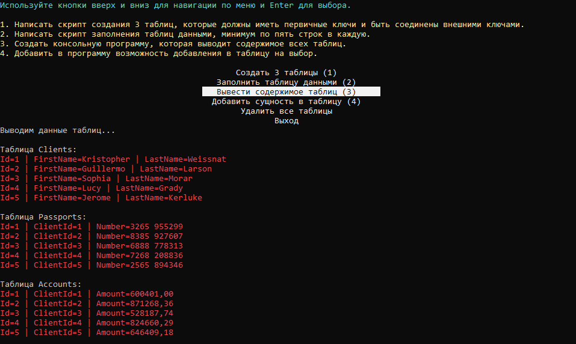

## Базы данных: реляционные базы и работа с ними
###### Вебинар от 10.08.23

### Домашнее задание
Подключаем базы данных к проекту

**Цель**:  
В этом домашнем задании вы научитесь создавать базу данных с таблицами, а также писать скрипты наполнения таблиц данными. Но самое главное - вы создадите приложение, способное получать данные из базы и добавлять новые.

### Описание/Пошаговая инструкция выполнения домашнего задания:
1. Создать базу данных PostgreSQL для одной из компаний на выбор: Авито, СберБанк, Otus или eBay.
2. Написать скрипт создания 3 таблиц, которые должны иметь первичные ключи и быть соединены внешними ключами.
3. Написать скрипт заполнения таблиц данными, минимум по пять строк в каждую.
4. Создать консольную программу, которая выводит содержимое всех таблиц.
5. Добавить в программу возможность добавления в таблицу на выбор.

### Инструкция запуска

1. Склонируйте приложение и зайдите в проект:  
   `git clone https://github.com/antoha-p/otus-hw1-10.08.23.git && cd otus-hw1-10.08.23`
2. Зайдите в каталог docker, скопируйте .env.example в .env и запустите докер:  
    `cd docker && cp .env.example .env && docker-compose up`
3. Откройте решение и запустите проект:

1. Настройки подключения к БД находятся в `App.config` (настроены для .env.example).
2. Скрипты обработчики для выполнения пунктов задания находятся в `Handler/`:
   1. `Handler/CreateTablesHandler.cs` - создаёт таблицы.
   2. `Handler/InsertAutoHandler.cs` - создаёт по 5 записей в таблицу.
   3. `Handler/ShowDataHandler.cs` - выводит содержимое всех таблиц.
   4. `Handler/InsertManualHandler.cs` - добавляет данные вручную.